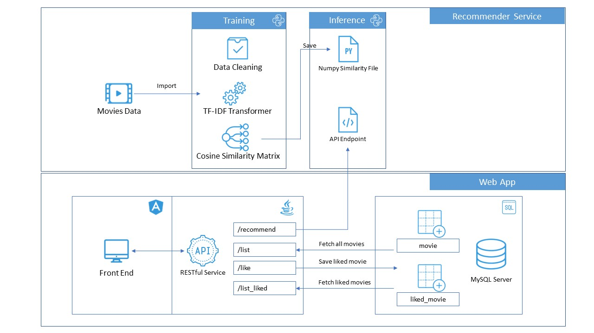

# movys
Movie recommendation app using content-based filtering. Data provided by TMDb.

# Demo

# About
This is a movie recommender application. It recommends similar movies to the movies you like.

- The recommendation service is a content based filtering service which reads a movie description and finds other movies with matching description.
- This recommendation services (Flask App) is served in a docker container and connected with the Spring Boot App (Java) based backend.
- The UI is developed with Angular and is coupled with the Spring Boot Application using Spring Thymeleaf.
- All movies and user-liked movies are stored with the help of in-memory db served by Apache Derby.

Data used in this application is downloaded from https://www.themoviedb.org/ using TMDb Developer API.

# Get the data

- <b>curl</b>

curl --location --request GET 'http://api.themoviedb.org/3/discover/movie?api_key=ADD_YOUR_API_KEY_HERE'

- <b>Python client</b>

<pre>
import requests

url = "http://api.themoviedb.org/3/discover/movie?api_key=ADD_YOUR_API_KEY_HERE"

payload = {}
headers= {}

response = requests.request("GET", url, headers=headers, data = payload)

print(response.text.encode('utf8'))
</pre>

- <b>Java client</b>

<pre>
OkHttpClient client = new OkHttpClient().newBuilder().build();
Request request = new Request.Builder()
  .url("http://api.themoviedb.org/3/discover/movie?api_key=ADD_YOUR_API_KEY_HERE")
  .method("GET", null)
  .build();
Response response = client.newCall(request).execute();
</pre>

# Architecture

# Credits
Inspired by the work of <b>Dean Sublett</b>

Read the blog - https://towardsdatascience.com/beginners-recommendation-systems-with-python-ee1b08d2efb6
